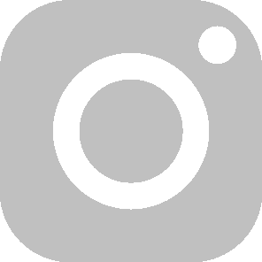

<section> 
  <figure>
    
  </figure>
  
  <figure>
    
  </figure>
  
  <h1 align="center">Μλπdιπι Zλπςнεττλ</h1>
 
  <h3 align="center">
    
Hey! Nice to see you here 😄

  </h3>
  <h4 align="center">
    
My name is Ricardo Mandini, I'm a CEO & Founder of digital products 🐝 with 5+ years of experience. I'm on the mission to inspire and groom people everywhere so that they can improve their lives, raise the bar, and contribute back to society🪄

    
  </h4> 
  

  
  

  
<b>:basketball: &nbsp;My hobbies:</b>

     
  
- ...are diverse - I enjoy making digital products 🖥️, producing music 🎵, and spending time outdoors with my family and friends 🌳. But above all else, what truly ignites my passion is creating! 💻🤓. 
    
- There's just something magical about bringing an idea to life and watching it come to fruition. 💡✨ Whether I'm designing a website 🌐, coding a new app 📱, or even just writing a story ✍️, I love the feeling of creating something from scratch. 

- Sure, my other hobbies are fun and enjoyable in their own right, but there's just something about the creative process that sets my soul on fire. 🔥 Whether I'm working on a personal project or something for work, I pour my heart and soul into every single creation.

- In the end, it's the act of creating that brings me the most joy and fulfillment, and I wouldn't have it any other way 💚

   

    
  

  
<b>:construction: &nbsp;Currently:</b>

   
  
- I'm working at <a href="https://github.com/Dogtorapp" target="_blank" rel="noreferrer noopener">@dogtorapp</a> as <b>CEO & Founder </b> in the Madrid Tech Hub!

   

  

  
<b>:seedling: &nbsp;My latest projects:</b>

   

   

  
<b>:telescope: &nbsp;Latest releases I've contributed to:</b>

   

- [trufflesecurity/trufflehog](https://github.com/trufflesecurity/trufflehog) - Find credentials all over the place

   

  
<b>:star: &nbsp;Recent Stars:</b>

   

- [trufflesecurity/trufflehog](https://github.com/trufflesecurity/trufflehog) - Find credentials all over the place

   

  

  
<b>:newspaper: &nbsp;Recent Work:</b>

   

- [Mandini Official Website](https://mandini.net)

   

  
<b>:thought_balloon: &nbsp;You can also ask me a question on:</b>

   

  - My [Public AMA](https://github.com/orgs/DogtorDev/discussions)

   

  
<b>:mailbox: &nbsp;How to reach me:</b>

   

- Website: [dogtorapp.com/mandini](https://dogtorapp.com/mandini)
- Email: [mandini@dogtorapp.com](mailto:mandini@dogtorapp.com)
- Twitter: [@mandiniCEO](https://twitter.com/mandiniCEO)

   

  
<b>:key: &nbsp;My PGP Public Key:</b>

   

 - [`EC7B EE3B 0561 BF2F`](https://keybase.io/maximousblk/pgp_keys.asc)

   

  
<b>:gear: &nbsp;GitHub Statistics:</b>

   
    

        
    

    

         
    

<h1> 
👨‍💻 Repositories 👨‍💻</h1>
 
  

&nbsp;

  

      

  
  

      

  
  

      

&nbsp;

&nbsp;

  

  <a href="https://github.com/zumrudu-anka?tab=repositories" title="Show Repositories">🔎 Show More 🔍</a>

 
  
&nbsp;

  
&nbsp;

  

  

  

  

&nbsp;

  

  <h2></h2>
  
  
  
  

